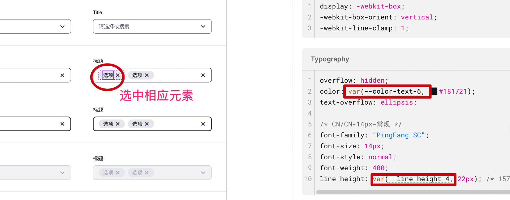

# App 组件库主题配置
## 通过 theme 中的 token 属性，可以修改一些主题变量。
>完整DEMO请看[Provider](/component/basic/provider)
### 1、整体使用
```javascript
// Demo.tsx
import React, { useState } from 'react';
import {
  Button,
  Provider,
  ThemeToken,
  Radio,
  Field,
  Space,
} from '@xrnjs/ui';
import Card from '_global/Card';
import Customer from './Customer';
import CustomerStatic from './CustomerStatic';

const Demo = () => {
  const [userThemeToken, setUserThemeToken] = useState<Partial<ThemeToken>>({
    '--color-primary-6': 'red', // 仅覆盖主题色--color-primary-6，其余默认配置
  });

  return (
    // 主题配置theme
    <Provider theme={userThemeToken}>
      <Space>
        <Card>
          <Radio
            value={userThemeToken['--color-primary-6']}
            options={[
              { label: '红色', value: 'red' },
              { label: '蓝色', value: 'blue' },
              { label: '绿色', value: 'green' },
            ]}
            onChange={(v) =>
              setUserThemeToken({ '--color-primary-6': v as string })
            }
          />
          <Button>主题色</Button>

          <Customer />
        </Card>
      </Space>
    </Provider>
  );
};

export default Demo;
```
### 2、业务中使用主题token

* 业务页面
```javascript
import React from 'react';
import { View, Text } from 'react-native';
import { useThemeStyle } from '@xrnjs/ui';
import styles from './styles';

const Customer = () => {
  /**
   * 方式一 （需要内联样式时候使用）
   * useTheme()获取themeToken，可用于组件内联样式取值 例如 themeToken['--color-text-6']
   */
  // const themeToken = useTheme(); // 获取当前组件库的所有主题配置Token
  // const userStyle = styles(themeToken); //获取相应主题的样式

  /**
   * 方式二 （建议无需内联样式时候使用）
   */
  // useThemeStyle直接获取样式
  const userStyle = useThemeStyle(styles);


  return (
    <View style={userStyle.contentStyle}>
      <Text>Customer 动态响应</Text>
    </View>
  );
};

export default Customer;

```


* 业务页面的样式styles.ts
```javascript
/**
 * 最新推荐用法 使用xtd-rn的StyleSheet.createTheme快速使用
 */
import { StyleSheet } from '@xrnjs/ui';

export default StyleSheet.createTheme((token) => {
  return {
    contentStyle: {
      backgroundColor: token['--color-primary-6'],
      width: 200,
      height: 100,
    },
  };
});

/**
 * 老用法 不推荐
 */
// import { StyleSheet } from 'react-native';
// import { ThemeToken } from '@xrnjs/ui';
//
// export default (token: ThemeToken) =>
//   StyleSheet.create({
//     contentStyle: {
//       backgroundColor: token['--color-primary-6'],
//       width: 200,
//       height: 100,
//     },
//   });

```

### 3、获取对应的主题token
从我们的figma设计图上获取，如下示例：

>若设计图缺少token请告知相应的设计同学添加即可




